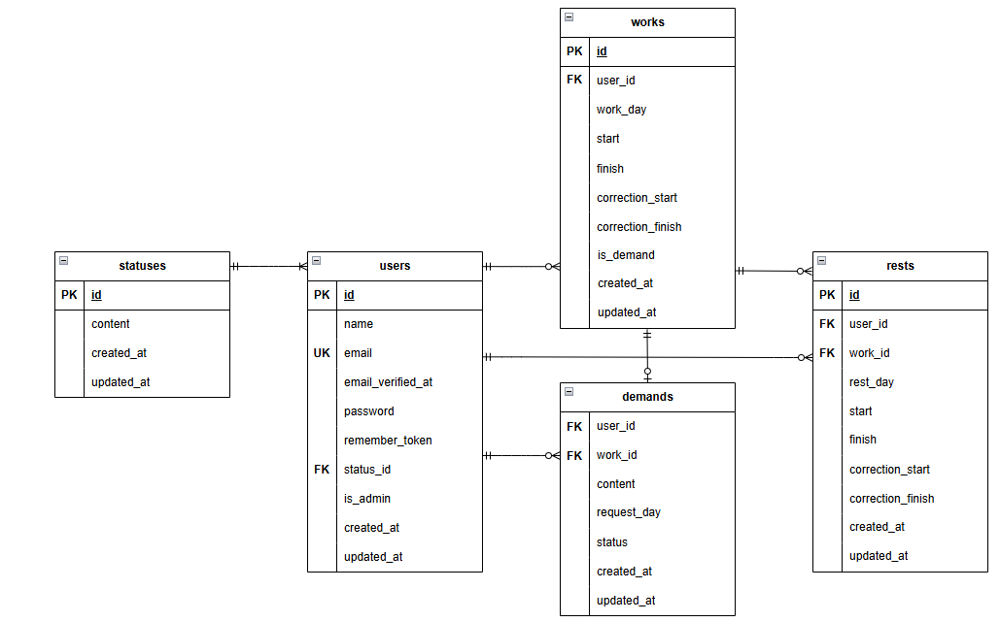

# coachtech 勤怠管理アプリ

## 環境構築
<dl>
    <dt>Dockerビルド</dt>
    <dd>1. git clone git@github.com:ao-kazuyuki/attendance_management.git</dd>
    <dd>2. cd attendance_management</dd>
    <dd>3. docker-compose up -d --build</dd>
</dl>

<dl>
    <dt>Laravel環境構築</dt>
    <dd>1. docker-compose exec php bash</dd>
    <dd>2. composer install</dd>
    <dd>3. exit
    <dd>4. cd src</dd>
    <dd>5. cp .env.example .env</dd>
    <dd>6. .envファイル内の下記の項目を以下のように修正</dd>
    <dd>DB_HOST=mysql</dd>
    <dd>DB_DATABASE=laravel_db</dd>
    <dd>DB_USERNAME=laravel_user</dd>
    <dd>DB_PASSWORD=laravel_pass</dd>
    <dd>7. docker-compose exec php bash</dd>
    <dd>8. php artisan key:generate</dd>
    <dd>9. php artisan migrate:fresh</dd>
    <dd>10. php artisan db:seed</dd>
    <dd>11. 管理者ユーザーは「http://localhost/admin/login」、一般ユーザーは「http://localhost/login」 にアクセスして動作確認をお願いします。</dd>
    <dd>※Windows環境などでファイルの権限エラーが発生する場合は適宜パーミッションの変更を行って下さい。</dd>
</dl>

<dl>
    <dt>管理者アカウントについて</dt>
    <dd>管理者アカウントは「山田太郎」という名前でメールアドレス「admin@test.jp」、パスワード「12345678」です。「http://localhost/admin/login」よりログインして下さい。管理者ユーザーが一般ユーザーとしてログインを試みた場合、管理者用ログインページにリダイレクトされます。</dd>
</dl>

<dl>
    <dt>一般ユーザーアカウントについて</dt>
    <dd>一般ユーザーアカウントは10アカウント分、ランダムな名前、メールアドレスで生成されます。パスワードは全一般ユーザーで「87654321」です。ユーザー名、メールアドレスについては、管理者ログイン後、「スタッフ一覧」ページで確認するか、「http://localhost:8080」の「laravel_db」→「users」テーブルを確認して下さい。一般ユーザーは「http://localhost/login」よりログインして下さい。一般ユーザーが管理者ユーザーとしてログインを試みた場合、一般ユーザー用ログインページにリダイレクトされます。</dd>
</dl>

<dl>
    <dt>メール認証について</dt>
    <dd>メール認証は「mailtrap」を使用しました。ユーザー登録をしていない場合は「https://mailtrap.io/」から会員登録をして下さい。</dd>
</dl>

<dl>
    <dt>勤怠データについて</dt>
    <dd>「php artisan db:seed」を実行した日より前の日で、直近３０日分の勤怠データが全ユーザー分、生成されます。出勤しない日もあることを想定しているので、１人のユーザーにつき、最大で３０件分の勤怠データが作成されます。出勤時間は８時を基準として±３時間の範囲で生成、退勤時間は出勤時間から最小で１時間、最大で１０時間の間で生成されます。休憩は勤務時間が8時間以上ある場合は30分の休憩が2回与えられます。勤務時間が8時間未満かつ5時間以上の場合は30分の休憩が1回与えられます。勤務時間が5時間未満の勤怠には休憩は付与されません。本アプリの休憩の仕様の確認がしやすいようにこのような仕様としました。</dd>
</dl>

<dl>
    <dt>追加で取り組んだこと</dt>
    <dd>勤怠の打刻画面の現在時間の表示は非同期で更新されるようにした。</dd>
</dl>

<dl>
    <dt>テスト環境構築</dt>
    <dd>1. docker-compose exec mysql bash</dd>
    <dd>2. mysql -u root -p</dd>
    <dd>※パスワードはdocker-compose.ymlの「MYSQL_ROOT_PASSWORD」の項を確認して下さい。</dd>
    <dd>3. CREATE DATABASE demo_test;</dd>
    <dd>4. exit</dd>
    <dd>5. exit</dd>
    <dd>6. cd src</dd>
    <dd>7. cp .env .env.testing</dd>
    <dd>8. .env.testingファイル内の下記の項目を以下のように修正</dd>
    <dd>APP_ENV=test</dd>
    <dd>APP_KEY=</dd>
    <dd>DB_DATABASE=demo_test</dd>
    <dd>DB_USERNAME=root</dd>
    <dd>DB_PASSWORD=root</dd>
    <dd>9. docker-compose exec php bash</dd>
    <dd>10. php artisan key:generate --env=testing</dd>
    <dd>11. php artisan config:clear</dd>
    <dd>12. php artisan migrate --env=testing</dd>
    <dd>13. exit</dd>
</dl>

<dl>
    <dt>テストファイル構成</dt>
    <dd>テストコードはスプレットシートのシート「テストケース一覧」のIDごとにテストファイルを生成し、tests/Featureフォルダ配下にあります。また、テストコードについては機能要件で定義されたものとテストケースで定義されたテスト内容が一致しないもの、また誤記等がいくつかあったので、状況を見て適宜修正した内容で、テストケースを作成しました。</dd>
    <dd>ID: 1 認証機能（一般ユーザー）　CertificationTest.php</dd>
    <dd>ID: 2 ログイン認証機能（一般ユーザー）　GeneralLoginTest.php</dd>
    <dd>ID: 3 ログイン認証機能（管理者）　AdminLoginTest.php</dd>
    <dd>ID: 4 日時取得機能　GetDateTest.php</dd>
    <dd>ID: 5 ステータス確認機能　CheckStatusTest.php</dd>
    <dd>ID: 6 出勤機能　AttendanceAtWorkTest.php</dd>
    <dd>ID: 7 休憩機能　RestTest.php</dd>
    <dd>ID: 8 退勤機能　LeavingWorkTest.php</dd>
    <dd>ID: 9 勤怠一覧情報取得機能（一般ユーザー）　GetGeneralAttendanceListTest.php</dd>
    <dd>ID:10 勤怠詳細情報取得機能（一般ユーザー）　GetGeneralAttendanceDetailTest.php</dd>
    <dd>ID:11 勤怠詳細情報修正機能（一般ユーザー）　GeneralCorrectionAttendanceTest.php</dd>
    <dd>ID:12 勤怠一覧情報取得機能（管理者）　GetAdminAttendanceListTest.php</dd>
    <dd>ID:13 勤怠詳細情報取得・修正機能（管理者）　AdminCorrectionAttendanceTest.php</dd>
    <dd>ID:14 ユーザー情報取得機能（管理者）　GetAdminUserInformationTest.php</dd>
    <dd>ID:15 勤怠情報修正機能（管理者）　AdminApprovalTest.php</dd>
    <dd>ID:16 メール認証機能　　MailTest.php</dd>
    <dd>※phpコンテナ内で vendor/bin/phpunit tests/Feature/xxxxx.phpのように各テストファイルを指定してテストを実行して下さい。</dd>
</dl>

## 使用技術
* PHP 7.4.9
* Laravel 8.83.29
* MySQL 8.0.26

## ER図

## URL
* 開発環境 : http://localhost/
* phpMyAdmin : http://localhost:8080/